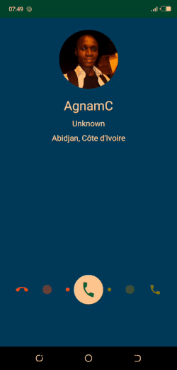

# Android Phone Caller UI
An android phone caller UI implementation. This is the **Tecno Camon 11** version powered by **hiOS**.

The purpose of this project is for practicing some **[animations](https://developer.android.com/training/animation/overview)** and **[touch gestures](https://developer.android.com/guide/input)**.

# Screenshot

# Credits
[Circle Image View](https://github.com/hdodenhof/CircleImageView) by hdodenhof
